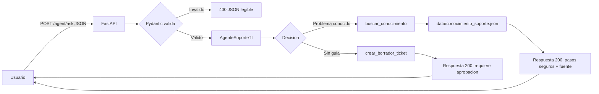

# Arquitectura y Mapa de Componentes

## Decisiones v0.1

| Capa | Componente | Responsabilidad | Tecnologia |
| --- | --- | --- | --- |
| Interfaz | API HTTP | Recibe JSON y devuelve estados HTTP verificables. | FastAPI |
| Validacion | Modelos de solicitud/respuesta | Rechaza contratos invalidos sin procesarlos. | Pydantic |
| Orquestacion | `AgenteSoporteTI` | Analiza el objetivo, decide entre guia o escalacion y aplica limites. | Python |
| Herramientas | Busqueda y borrador de ticket | Consulta conocimiento y prepara, sin enviar, una escalacion. | Python |
| Datos | Base de conocimiento | Contiene diagnosticos y pasos seguros versionados. | JSON local |
| Configuracion | `.env.example` y `.gitignore` | Documenta variables y evita publicar secretos. | Variables de entorno |
| Calidad | Pruebas | Verifican JSON, diagnostico, escalacion y HTTP. | Pytest |

## Mapa del flujo

## Ciclo cloud-native del agente

1. **Objetivo:** resolver una incidencia descrita en `question`.
2. **Contexto:** recibe `user_id` y datos opcionales del dispositivo.
3. **Decision:** determina si existe un articulo de soporte aplicable.
4. **Herramientas:** consulta `conocimiento_soporte.json` o prepara un borrador de escalacion.
5. **Observacion:** devuelve `sources`, `next_action` y `needs_approval` para hacer visible el resultado.
6. **Limites:** no ejecuta comandos administrativos, no instala software, no cambia contrasenas, no modifica configuraciones criticas y no envia tickets automaticamente.

## Limite de la v0.1

La base de conocimiento y los borradores son locales y no persistentes. Un despliegue posterior debe añadir autenticacion, almacenamiento de tickets, observabilidad y un gestor de secretos.