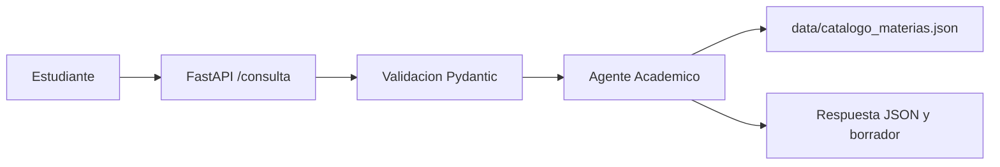

# Arquitectura

El agente es un orquestador determinista: recibe datos validados, consulta el catalogo y devuelve una respuesta JSON. Mantener el catalogo como archivo versionado permite revisar cada cambio de prerrequisitos mediante Git.